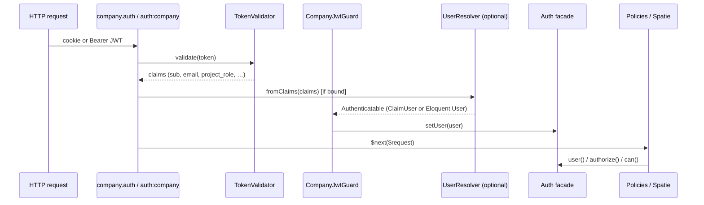

# Auth guard integration — to-do list

> **Status:** Planning only (not implemented yet)  
> **Goal:** Bridge JWT SSO (`company.auth` / `CurrentUser`) with Laravel’s `Auth` facade so **policies**, **gates**, and **Spatie Laravel Permission** work without every consuming app re-implementing “who is logged in?” twice per request.

---

## Why this exists

Today the package authenticates on a **parallel track**:

| Layer | Mechanism today | Used by |
|-------|-----------------|---------|
| Identity from JWT | `company.auth` → `CurrentUserService` / `CurrentUser` facade | Controllers, `/me` |
| Laravel authorization | `Auth::user()`, default `web` guard | Policies, `$this->authorize()`, `@can`, Spatie `HasRoles` |

Consuming apps that use Spatie or policies must **repeat** work on every request:

1. Trust the package for JWT validation (`CurrentUser::id()`).
2. Separately resolve a `User` model (or manual checks) for `$user->can()` / policies.

A **`company` auth guard** (plus an optional user resolver) makes step 1 and 2 happen in **one place**: validate JWT once, set `Auth::user()` once.

**Important:** The IdP JWT does **not** replace per-tool permission tables. Spatie still needs a local Eloquent `User` (or equivalent). The guard’s job is to **connect** JWT `sub` → that model, not to store roles in the package.

---

## Target architecture (after implementation)



**Single source of truth per request:** `Auth::user()` (with `CurrentUser` optionally delegating to it for backward compatibility).

---

## Design decisions (lock these before coding)

| # | Decision | Recommendation | Rationale |
|---|----------|----------------|-----------|
| D1 | Guard driver name | `company` | Distinct from `web` / `sanctum`; matches middleware alias mental model |
| D2 | Default user when no resolver | `CompanyAuthUser` (claim DTO implementing `Authenticatable`) | Works for policies/gates without a DB; no Eloquent required |
| D3 | Spatie / DB permissions | Opt-in `AuthenticatableResolver` contract in **consuming app** | Package must not own `users` / `roles` tables |
| D4 | Middleware strategy | `AuthMiddleware` sets guard user; alias `auth:company` optional | Preserve token-expired redirect and cookie behaviour |
| D5 | `CurrentUser` facade | Keep; implement via `Auth::user()` when guard ran | Avoid breaking existing integrations |
| D6 | New dependency | `illuminate/auth` in `require` | Required for `Guard`, `Authenticatable`, `Auth::extend` |
| D7 | Revocation blacklist (planned) | Guard/middleware calls validator **then** blacklist check | Same order as `docs/SECURE_DEFAULTS.md` §8 |

---

## Phase 0 — Prerequisites & alignment

Read before starting implementation.

- [ ] **0.1 — Re-read contracts**  
  Confirm JWT claims in `CURSOR_CONTEXT.md` and `docs/SECURE_DEFAULTS.md` (`sub`, `jti`, `aud` / `project_id`, `project_role`, `exp`, `iss`). Guard and `CompanyAuthUser` must expose the same fields `CurrentUserService` exposes today.

- [ ] **0.2 — Agree non-goals**  
  Package will **not**: define Spatie roles, ship migrations, or implement `CurrentUser::can()`. Fine-grained permissions stay in each tool.

- [ ] **0.3 — Choose minimum Laravel version for guard API**  
  Test against Laravel 10, 11, and 12 via Testbench matrix (match existing `composer.json` illuminate constraints).

- [ ] **0.4 — Plan deprecation story**  
  Document whether `company.auth` remains forever, becomes a thin wrapper around `auth:company`, or both are supported long-term.

**Done when:** Team agrees on D1–D7 and non-goals; no code required.

---

## Phase 1 — Foundation (package core)

### 1.1 — Add `illuminate/auth` dependency

- [ ] Add `"illuminate/auth": "^10.0|^11.0|^12.0|^13.0"` to `composer.json` `require`.
- [ ] Run `composer update` and fix any conflict with existing illuminate packages.

**Acceptance:** `composer install` succeeds; CI still passes.

---

### 1.2 — `CompanyAuthUser` (claim-backed `Authenticatable`)

- [ ] Create `src/Auth/CompanyAuthUser.php` implementing `Illuminate\Contracts\Auth\Authenticatable`.
- [ ] Wrap validated JWT claims (`stdClass` or array); expose:
  - `getAuthIdentifier()` → `sub`
  - Accessors: `email()`, `globalRole()`, `projectId()` / `aud`, `role()` / `project_role`
  - `getAuthIdentifierName()` → `'sub'`
- [ ] Password-related methods: return `''` / `null` (SSO — no local password); document why.
- [ ] Optional: implement `Illuminate\Contracts\Auth\Access\Authorizable` if we want `$user->can()` for **JWT-only** coarse checks (defer unless needed).

**Acceptance:** Unit test constructs user from fake claims; identifier and accessors match `CurrentUserService` behaviour.

---

### 1.3 — Extract shared “get token from request” logic

- [ ] Move bearer + cookie extraction from `AuthMiddleware` into e.g. `src/Support/TokenExtractor.php` (or trait used by middleware + guard).
- [ ] Keep priority: `Authorization: Bearer` first, then `token` httpOnly cookie (same as today).

**Acceptance:** Existing `AuthMiddlewareTest` still pass; no behaviour change.

---

### 1.4 — `CompanyJwtGuard`

- [ ] Create `src/Auth/CompanyJwtGuard.php` implementing `Illuminate\Contracts\Auth\Guard`.
- [ ] Dependencies: `TokenValidator`, `TokenExtractor`, optional `AuthenticatableResolver`.
- [ ] `user()` / `check()` / `id()`:
  - Lazy-validate token on first access (cache user on guard for request lifetime).
  - On invalid/expired token: return `null` / `false` (middleware handles HTTP responses).
- [ ] `validate(array $credentials)`: not used for SSO — return `false` or throw `BadMethodCallException` (document).
- [ ] `setUser()` / `login()`: allow tests and middleware to set user after validation.

**Acceptance:** Guard unit tests with mocked `TokenValidator`; valid JWT sets user; invalid returns guest.

---

### 1.5 — Optional `AuthenticatableResolver` contract

- [ ] Create `src/Contracts/AuthenticatableResolver.php`:
  ```php
  public function resolve(stdClass $claims): Authenticatable;
  ```
- [ ] Package default binding: returns `CompanyAuthUser` from claims.
- [ ] Document that consuming apps bind their own implementation to map `sub` → Eloquent `User` (for Spatie).

**Acceptance:** Testbench test with custom resolver returning a fake `Authenticatable`.

---

### 1.6 — Register guard in `AuthServiceProvider`

- [ ] `Auth::extend('company', …)` registering `CompanyJwtGuard`.
- [ ] Publish or document `config/auth.php` snippet:
  ```php
  'guards' => [
      'company' => ['driver' => 'company'],
  ],
  'defaults' => [ /* do NOT change consuming app default without docs */ ],
  ```
- [ ] Bind `AuthenticatableResolver` to default claim-user resolver.

**Acceptance:** In Testbench, `Auth::guard('company')->check()` is true when valid cookie present.

---

## Phase 2 — Wire middleware & backward compatibility

### 2.1 — Update `AuthMiddleware` to populate Auth

- [ ] After successful `TokenValidator::validate()`:
  1. Resolve user via `AuthenticatableResolver` (or `CompanyAuthUser`).
  2. `Auth::guard('company')->setUser($user)`.
  3. Keep `CurrentUserService::setFromClaims()` **or** refactor `CurrentUserService` to read from `Auth::guard('company')->user()`.
- [ ] Preserve existing behaviour:
  - 401 JSON when no token
  - Expired JWT → redirect `company-auth.token-expired` + forget cookie (non-JSON)
  - JSON 401 with message for other invalid tokens

**Acceptance:** All existing `AuthMiddlewareTest` and `MeEndpointTest` pass unchanged.

---

### 2.2 — Route middleware alias `auth:company`

- [ ] Document using `Route::middleware(['web', 'auth:company'])` as equivalent to `web` + `company.auth` once guard is registered.
- [ ] Decide: register `auth:company` in package boot **or** only document that apps add `'company'` guard and use `auth:company` (Laravel built-in).

**Acceptance:** Feature test: route with `auth:company` returns 200 with valid JWT; 401 without.

---

### 2.3 — Align `CurrentUser` facade with Auth

- [ ] Option A (preferred): `CurrentUserService` delegates to `Auth::guard('company')->user()` when set.
- [ ] Option B: Keep dual storage but sync both in middleware (higher bug risk).
- [ ] Update facade PHPDoc to reference `CompanyAuthUser` / `Authenticatable`.

**Acceptance:** `CurrentUser::id()` and `Auth::guard('company')->id()` return same value after middleware.

---

## Phase 3 — Consuming app integration (documentation & examples)

### 3.1 — Policy example (no Spatie)

- [ ] Add `docs/examples/policy-with-claim-user.md`:
  - Policy method receives `CompanyAuthUser $user`
  - `$this->authorize('update', $post)` on `auth:company` routes

---

### 3.2 — Spatie example (Eloquent resolver)

- [ ] Add `docs/examples/spatie-resolver.md`:
  - Local `User` model with `HasRoles`
  - `idp_sub` column matches JWT `sub`
  - Sample `App\Auth\JwtUserResolver` implementing `AuthenticatableResolver`
  - Register binding in consuming app `AppServiceProvider`
  - First login: `firstOrCreate` by `sub` (document race conditions / IdP as source of email)

**Acceptance:** Copy-paste example is coherent; no package migrations.

---

### 3.3 — Update `CURSOR_CONTEXT.md`

- [ ] Add row to responsibilities table: `CompanyJwtGuard`, `CompanyAuthUser`, `AuthenticatableResolver`.
- [ ] Update integration snippet to show **either** `company.auth` **or** `auth:company`.
- [ ] Clarify: `/me` `permissions` remain JWT-only `[]` / `["*"]`; Spatie permissions are separate.

---

### 3.4 — Update `PACKAGE_BUILD_GUIDE.md` (optional new step)

- [ ] Add “Step N — Auth guard” with file list and test checklist mirroring this doc.

---

## Phase 4 — Tests

| Test | Type | Covers |
|------|------|--------|
| `CompanyAuthUserTest` | Unit | Claims mapping, identifier |
| `CompanyJwtGuardTest` | Unit | Valid/invalid/expired token, lazy load |
| `AuthMiddlewareSetsGuardUserTest` | Feature | `Auth::guard('company')->check()` after middleware |
| `PolicyAuthorizesWithCompanyGuardTest` | Feature | Sample policy + `authorize()` |
| `CustomResolverTest` | Feature | App-bound resolver returns custom user |
| Regression | Feature | Existing middleware, `/me`, callback tests green |

- [ ] **4.1** — Implement tests above.
- [ ] **4.2** — PHPStan: stub or generic types for `Auth::user()` return (`CompanyAuthUser|Authenticatable|null`).

**Done when:** `composer test` and `composer analyse` pass.

---

## Phase 5 — Hardening & future work

### 5.1 — Revocation blacklist (when Phase 1 IdP work lands)

- [ ] After JWT verify in guard/middleware, check `sub` / `jti` against blacklist (`docs/SECURE_DEFAULTS.md` §8).
- [ ] Treat blacklisted token like invalid → 401 / redirect consistent with today.

---

### 5.2 — Config knobs (only if needed)

- [ ] `config/company-auth.php`: `guard` => `'company'`, `resolver` => null (use default).
- [ ] Avoid making consuming apps duplicate `config/auth.php` if package can merge guard definition via service provider (research Laravel 11+ guard registration).

---

### 5.3 — Versioning & release

- [ ] Tag **minor** release (e.g. `v1.1.0`) — additive; `CurrentUser` remains.
- [ ] CHANGELOG entry: guard feature, migration notes for Spatie apps.

---

## Implementation order (quick reference)

```
Phase 0 (agree) → 1.1 dep → 1.2 CompanyAuthUser → 1.3 TokenExtractor
    → 1.4 Guard → 1.5 Resolver contract → 1.6 Register guard
    → 2.1 Middleware + Auth → 2.2 auth:company → 2.3 CurrentUser align
    → 3.x Docs → 4.x Tests → 5.x Blacklist & release
```

**Suggested first PR:** Phase 1.1–1.6 + Phase 4 unit tests (guard only, no middleware change).  
**Second PR:** Phase 2 + feature tests + docs.  
**Third PR:** Examples + Spatie doc + changelog.

---

## Checklist for consuming apps (after package ships)

Use this when upgrading an internal tool — not package implementation work.

- [ ] Add `company` guard to `config/auth.php` (or rely on package-published config).
- [ ] Replace duplicate `CurrentUser::id()` + manual `User::find` with one resolver (if using Spatie).
- [ ] Register `AuthenticatableResolver` binding when using Spatie.
- [ ] Ensure `users.idp_sub` (or equivalent) indexed; matches JWT `sub`.
- [ ] Switch protected routes to `auth:company` **or** keep `company.auth` (both should work).
- [ ] Policies: type-hint `CompanyAuthUser` or app `User` depending on resolver.
- [ ] Do **not** expect package `/me` to return Spatie permission names.

---

## Open questions (resolve in Phase 0)

1. Should the package set `config('auth.defaults.guard')` to `company`? **Recommendation:** No — only document; apps opt in.
2. Should `CompanyAuthUser` implement `Authorizable` for coarse JWT `project_role` gates? **Recommendation:** Defer; apps can use gates on `project_role` manually.
3. API-only apps using `sanctum` + SSO cookie in same project — document guard choice per route group.

---

## Related files (today)

| File | Role after guard |
|------|------------------|
| `src/AuthMiddleware.php` | Validates JWT, sets guard user, HTTP 401/redirect |
| `src/CurrentUserService.php` | Delegates to guard user or wraps claims |
| `src/TokenValidator.php` | Unchanged — shared validation |
| `src/AuthServiceProvider.php` | Register guard + resolver |
| `docs/SECURE_DEFAULTS.md` | Security rules unchanged |

---

*Last updated: planning draft for JWT ↔ Laravel Auth bridge.*
