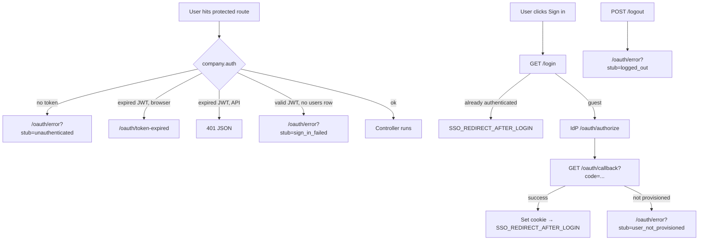

# Child application reference — routes, controllers, redirects & APIs

> **Audience:** developers and AI agents integrating `baaboo/internal-tool-composer-auth-package` into an internal Laravel tool.
>
> **Related:** [INSTALLATION.md](./INSTALLATION.md) · [SECURE_DEFAULTS.md](./SECURE_DEFAULTS.md) · [CURSOR_CONTEXT.md](../CURSOR_CONTEXT.md)

This document is the **canonical lookup** for what the package registers automatically, what the consuming app must wire, and **where to redirect** users during login, logout, and auth failures.

---

## Quick lookup (for AI agents)

```yaml
package: baaboo/internal-tool-composer-auth-package
namespace: Baaboo\InternalToolComposerAuthPackage
auth_middleware: company.auth
guest_middleware: company.guest
sso_guard: sso                    # Auth::guard('sso')
token_cookie: token               # httpOnly, 10 hours, SameSite=Lax
idp_base_url: CompanyAuth::idpUrl()   # https://auth.company.com (local: IDP_URL)

# Package-registered routes (use route() names — never hard-code paths)
routes:
  login:              { method: GET,  path: /login,              name: login }
  logout:             { method: POST, path: /logout,             name: logout }
  oauth_callback:     { method: GET,  path: /oauth/callback,     name: company-auth.callback }
  token_expired:      { method: GET,  path: /oauth/token-expired,  name: company-auth.token-expired }
  error_page:         { method: GET,  path: /oauth/error,          name: company-auth.error }

# Consuming app MUST register (not auto-loaded)
routes_app_registers:
  me: { method: GET, path: /me, controller: MeController, middleware: [web, company.auth] }

# Redirect targets child apps should use
redirect_when:
  user_not_logged_in: route('login')                    # or company-auth.error?stub=unauthenticated (middleware does this)
  session_expired:    route('company-auth.token-expired')
  after_logout:       route('company-auth.error', ['stub' => 'logged_out'])
  access_denied:      route('company-auth.error', ['stub' => 'access_denied'])
```

**Rules agents must not violate**

| Do | Do not |
|----|--------|
| `redirect()->route('login')` for unauthenticated users | Register a custom `GET /login` handler |
| `route('logout')` with `POST` + `@csrf` | `GET /logout` or duplicate logout routes |
| `middleware(['web', 'company.auth'])` on protected routes | `auth` / `auth:web` alone (ignores JWT cookie) |
| `route('company-auth.callback')` as IdP redirect URI | Custom `/auth/callback` or `/oauth/callback` in the app |
| `CurrentUser::` after `company.auth` | Read JWT from `localStorage` or JS |

---

## Package-provided HTTP routes

Loaded from `routes/company-auth.php` via `AuthServiceProvider` — **no manual import** in the child app.

| HTTP | Path | Route name | Middleware | Controller |
|------|------|------------|------------|------------|
| `GET` | `/login` | `login` | `web`, `company.guest`, throttle 60/min | `AuthLoginController` |
| `POST` | `/logout` | `logout` | `web`, throttle 60/min | `AuthLogoutController` |
| `GET` | `/oauth/callback` | `company-auth.callback` | `web`, throttle 20/min | `AuthCallbackController` |
| `GET` | `/oauth/token-expired` | `company-auth.token-expired` | `web`, throttle 60/min | `TokenExpiredController` |
| `GET` | `/oauth/error` | `company-auth.error` | `web`, throttle 60/min | `ErrorController` |

### Route the child app registers

| HTTP | Path | Suggested route name | Middleware | Controller |
|------|------|----------------------|------------|------------|
| `GET` | `/me` | `me` (your choice) | `web`, `company.auth` | `MeController` |

```php
// routes/web.php — consuming app
use Baaboo\InternalToolComposerAuthPackage\Http\Controllers\MeController;

Route::middleware(['web', 'company.auth'])->group(function () {
    Route::get('/me', MeController::class)->name('me');
    Route::get('/dashboard', DashboardController::class);
});
```

---

## Controllers

All controllers live under `Baaboo\InternalToolComposerAuthPackage\Http\Controllers\`.

### `AuthLoginController` — `GET /login` (`login`)

| | |
|---|---|
| **Purpose** | Start SSO login — redirect browser to IdP OAuth authorize URL |
| **Input** | None |
| **Output** | `302` redirect to `{idpUrl}/oauth/authorize?...` |
| **Middleware** | `company.guest` — if user already has valid JWT + local `users` row, redirects to `SSO_REDIRECT_AFTER_LOGIN` instead |

**Child app usage**

```php
// Laravel 11+ bootstrap/app.php — guest redirect
->redirectGuestsTo(fn () => route('login'));

// Blade link
<a href="{{ route('login') }}">Sign in</a>
```

**Do not** implement a local login form. The IdP owns credentials.

---

### `AuthCallbackController` — `GET /oauth/callback` (`company-auth.callback`)

| | |
|---|---|
| **Purpose** | OAuth authorization-code exchange, JWT validation, local user sync, set cookie |
| **Input** | Query `code` (one-time authorization code from IdP) |
| **Success** | `302` to `SSO_REDIRECT_AFTER_LOGIN` (default `/`) + `Set-Cookie: token=...` (httpOnly) |
| **Failure** | `400` missing/invalid code · `403` exchange/validation error · redirect to `company-auth.error?stub=user_not_provisioned` |

**Flow (internal — do not reimplement in child app)**

1. `POST` code to IdP `{idpUrl}/oauth/token`
2. Validate JWT (RS256, `exp`, `iss`, `aud`, `project_id`, `jti`)
3. Upsert `users` row from claims (`sub`, `email`, `name`) when `createUser` claim allows
4. Set `token` cookie (10-hour TTL)

**IdP redirect URI must be:** `{APP_URL}/oauth/callback`

Verify: `php artisan route:list --name=company-auth.callback`

---

### `AuthLogoutController` — `POST /logout` (`logout`)

| | |
|---|---|
| **Purpose** | End local session, optionally notify IdP, clear cookie, show logged-out page |
| **Input** | CSRF token (required — `web` middleware) |
| **Output** | `302` to `company-auth.error?stub=logged_out` + expired `token` cookie |

When `SSO_REDIRECT_TO_IDP_LOGOUT=true` (default), POSTs user's JWT to IdP `POST /oauth/session/end` with `Authorization: Bearer`.

**Child app usage**

```blade
<form method="POST" action="{{ route('logout') }}">
    @csrf
    <button type="submit">Log out</button>
</form>
```

```javascript
// SPA — must include CSRF cookie + header
await fetch('/logout', { method: 'POST', credentials: 'include', headers: { 'X-XSRF-TOKEN': csrf } });
```

---

### `TokenExpiredController` — `GET /oauth/token-expired` (`company-auth.token-expired`)

| | |
|---|---|
| **Purpose** | Browser-friendly HTML when JWT is expired |
| **Input** | None |
| **Output** | `200` HTML page with link to `route('login')` |

**When reached automatically:** `company.auth` redirects here (and clears cookie) when token is expired and request does **not** expect JSON.

**Child app usage:** Usually no direct redirect needed — middleware handles it. Link manually only for custom UX:

```php
return redirect()->route('company-auth.token-expired');
```

---

### `ErrorController` — `GET /oauth/error` (`company-auth.error`)

| | |
|---|---|
| **Purpose** | Shared HTML error page with configurable copy |
| **Input** | Query `stub` (optional) — key into `config('company-auth.errors')` |
| **Output** | `200` HTML with `message` + `description` |

**Built-in stubs** (override copy in published `config/company-auth.php`):

| `stub` | When to redirect | Default message |
|--------|------------------|-----------------|
| `unauthenticated` | No token / not logged in | Unauthenticated — Please log in to continue. |
| `logged_out` | After logout (package default) | Logged out |
| `sign_in_failed` | Valid JWT but no local `users` row | Sign-in failed |
| `user_not_provisioned` | Callback: `createUser=false` and no row | Account not available |
| `access_denied` | App-level access denial (you redirect) | Access denied |
| *(missing/unknown)* | Fallback | Token Expired |

**Child app usage**

```php
// Deny access to this tool (e.g. missing app-specific role)
return redirect()->route('company-auth.error', ['stub' => 'access_denied']);

// Prefer login redirect for “please sign in” in your own code
return redirect()->route('login');
```

Package internals also redirect to `unauthenticated`, `sign_in_failed`, and `logged_out` — see [Redirect flow](#redirect-flow).

---

### `MeController` — `GET /me` (app-registered)

| | |
|---|---|
| **Purpose** | JSON identity for SPAs and API clients (cookie or Bearer JWT) |
| **Input** | `token` cookie or `Authorization: Bearer <jwt>` |
| **Output** | `200` JSON (stable contract) |
| **Requires** | `company.auth` middleware on the route |

**Response contract (do not change keys or semantics)**

```json
{
  "name": "jane@company.com",
  "role": "manager",
  "permissions": []
}
```

| Field | Source | Notes |
|-------|--------|-------|
| `name` | JWT `email` | Display name until IdP adds a dedicated claim |
| `role` | JWT `project_role` | Coarse IdP role: `admin`, `manager`, `editor`, `viewer`, … |
| `permissions` | Derived | `["*"]` only when `role === "admin"`; otherwise `[]` |

**Not** application permissions (Spatie, DB roles, gates). Those stay in the child app.

**SPA fetch example**

```javascript
const res = await fetch('/me', { credentials: 'include' });
if (res.status === 401) { window.location.href = '/login'; }
const user = await res.json();
```

---

## Middleware

Registered in `AuthServiceProvider::boot()`.

### `company.auth` → `AuthMiddleware`

Apply to **every protected route** (with `web` for browser apps).

| Condition | Browser (`Accept: text/html`) | JSON (`expectsJson()`) |
|-----------|------------------------------|-------------------------|
| No token | Redirect → `company-auth.error?stub=unauthenticated` | `401` JSON |
| Expired token | Redirect → `company-auth.token-expired` + clear cookie | `401` JSON |
| Invalid token | `401` JSON | `401` JSON |
| Valid JWT, no `users` row | Redirect → `company-auth.error?stub=sign_in_failed` | `401` JSON |
| Success | Sets `CurrentUser` claims + `Auth::guard('sso')->setUser()` | Same |

```php
Route::middleware(['web', 'company.auth'])->group(function () {
    // protected routes
});
```

### `company.guest` → `GuestMiddleware`

JWT-aware replacement for Laravel's `guest` middleware. Already applied to package `GET /login`.

| Condition | Behaviour |
|-----------|-----------|
| Valid JWT + local user | Redirect → `SSO_REDIRECT_AFTER_LOGIN` |
| Otherwise | Continue to login (IdP redirect) |

**Do not** add Laravel `guest` middleware to `/login` — it checks the `web` guard, not the SSO cookie.

---

## Redirect flow



### Redirect cookbook

| Scenario | Recommended redirect |
|----------|---------------------|
| User must sign in (your controller) | `redirect()->route('login')` |
| Laravel guest middleware replacement | `redirectGuestsTo(fn () => route('login'))` |
| Token expired (custom handling) | `redirect()->route('company-auth.token-expired')` |
| Logged out confirmation | `redirect()->route('company-auth.error', ['stub' => 'logged_out'])` |
| User lacks app access | `redirect()->route('company-auth.error', ['stub' => 'access_denied'])` |
| After successful SSO (package handles) | `SSO_REDIRECT_AFTER_LOGIN` env (default `/`) |

---

## PHP APIs for child app controllers

### `CurrentUser` facade

Namespace: `Baaboo\InternalToolComposerAuthPackage\Facades\CurrentUser`

Available **only after** `company.auth` runs on the current request.

| Method | JWT claim | Return type | Description |
|--------|-----------|-------------|-------------|
| `CurrentUser::id()` | `sub` | `string` | User UUID (matches `users.id`) |
| `CurrentUser::email()` | `email` | `string` | User email |
| `CurrentUser::globalRole()` | `global_role` | `string` | Platform role: `super_admin`, `staff` |
| `CurrentUser::projectId()` | `aud` | `string` | Tool slug (same as `SSO_PROJECT_ID`) |
| `CurrentUser::role()` | `project_role` | `string` | Coarse tool role from IdP |
| `CurrentUser::all()` | — | `?stdClass` | Raw claims (debug/logging) |

```php
use Baaboo\InternalToolComposerAuthPackage\Facades\CurrentUser;

public function index()
{
    $email = CurrentUser::email();
    $role  = CurrentUser::role();

    if ($role !== 'admin') {
        return redirect()->route('company-auth.error', ['stub' => 'access_denied']);
    }
}
```

Throws `RuntimeException` if called without `company.auth`.

---

### `Auth::guard('sso')` — `SsoJwtGuard`

| Method | Description |
|--------|-------------|
| `Auth::guard('sso')->user()` | `App\Models\User` Eloquent model (from local `users` table) |
| `Auth::guard('sso')->id()` | User primary key (JWT `sub`) |
| `Auth::guard('sso')->check()` | Whether user is set for this request |
| `Auth::guard('sso')->guest()` | Inverse of `check()` |

Use for policies, gates, Spatie `can()`, and anything expecting `Authenticatable`.

```php
$user = Auth::guard('sso')->user();
$this->authorize('view', $report);
```

Constants: `CompanyAuth::SSO_GUARD` (`sso`), `CompanyAuth::USER_PROVIDER` (`users`), `CompanyAuth::USER_MODEL` (`App\Models\User`).

---

### `CompanyAuth` platform constants

| Symbol | Value | Use in child app |
|--------|-------|------------------|
| `CompanyAuth::idpUrl()` | Production IdP URL; local override via config | Build links to IdP portal (rare) |
| `CompanyAuth::TOKEN_COOKIE_NAME` | `token` | Document in frontend (never read from JS) |
| `CompanyAuth::TOKEN_COOKIE_MINUTES` | `600` (10 hours) | Align session UX expectations |
| `CompanyAuth::SSO_GUARD` | `sso` | `Auth::guard(CompanyAuth::SSO_GUARD)` |

Child apps should **not** call `TokenValidator` directly — use middleware.

---

## Environment variables (child app `.env`)

| Variable | Required | Default | Maps to |
|----------|----------|---------|---------|
| `SSO_PROJECT_ID` | Yes | — | JWT `aud` / `project_id`; OAuth `client_id` fallback |
| `SSO_CLIENT_SECRET` | Yes | — | Code exchange at callback |
| `SSO_CLIENT_ID` | No | `SSO_PROJECT_ID` | OAuth authorize `client_id` |
| `SSO_REDIRECT_AFTER_LOGIN` | No | `/` | Post-callback + `company.guest` redirect |
| `SSO_REDIRECT_TO_IDP_LOGOUT` | No | `true` | Call IdP session end on logout |
| `IDP_URL` | Local only | `http://baaboo-sso.test` | IdP base when `APP_ENV=local` |

---

## JWT claims reference

Present in every access token after successful login:

```json
{
  "sub": "uuid-of-user",
  "email": "user@company.com",
  "global_role": "staff",
  "aud": "hr-portal",
  "project_id": "hr-portal",
  "project_role": "manager",
  "exp": 1234567890,
  "jti": "unique-token-id",
  "createUser": true
}
```

| Claim | Used by |
|-------|---------|
| `sub` | `CurrentUser::id()`, `users.id`, `Auth::guard('sso')` |
| `email` | `CurrentUser::email()`, `/me` `name` |
| `project_role` | `CurrentUser::role()`, `/me` `role` |
| `global_role` | `CurrentUser::globalRole()` |
| `createUser` | Callback: whether to upsert `users` row |

---

## Verification commands

```bash
# List package routes
php artisan route:list --name=login
php artisan route:list --name=company-auth

# Confirm callback URL for IdP registry
php artisan route:list --name=company-auth.callback
```

---

## See also

| Document | Contents |
|----------|----------|
| [INSTALLATION.md](./INSTALLATION.md) | Full install, env, migrations, troubleshooting |
| [SECURE_DEFAULTS.md](./SECURE_DEFAULTS.md) | Cookie flags, CSRF, revocation, logout security |
| [prompts/INTEGRATE_LARAVEL_SSO_PACKAGE.md](./prompts/INTEGRATE_LARAVEL_SSO_PACKAGE.md) | Copy-paste agent prompt for consuming apps |
